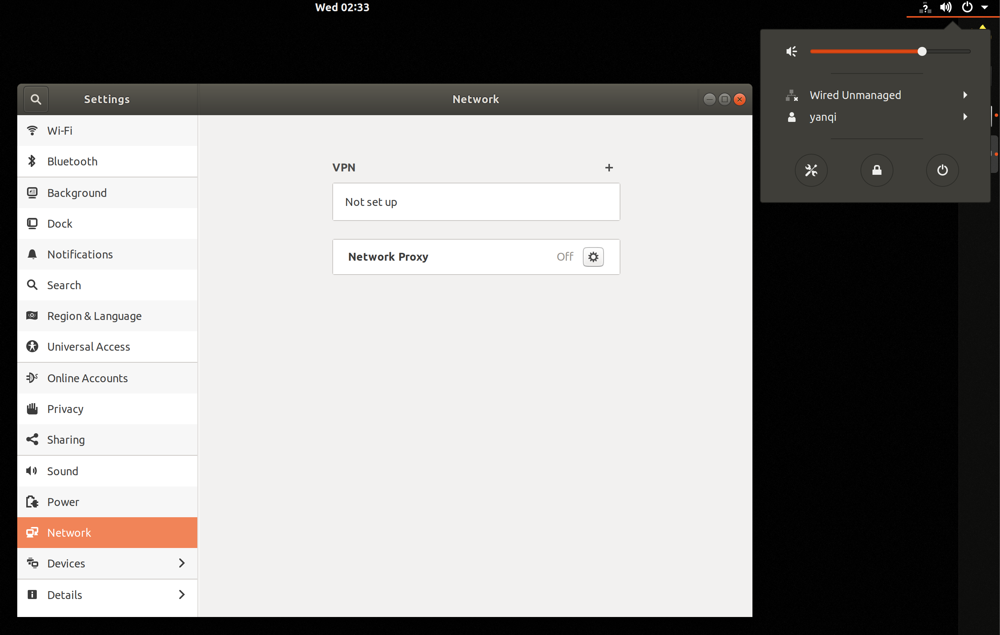

This post is about the Wired Unmanaged problem I encountered when I tried to configure a static IP address for my Ubuntu virtual machine.

When I tried the following guide [虚拟机 Ubuntu 解决静态ip配置问题](https://blog.csdn.net/weixin_44860390/article/details/125122710), I found that the network manager was not working, Like the following picture:

This problem is the first time I have seen it. I have configured it many times based on that guide, but I have never encountered this situation. So I went to Google to find a solution to the problem and finally found a solution. I will record it here.

## Solution
1. Add a missing config file with
```bash
sudo touch /etc/NetworkManager/conf.d/10-globally-managed-devices.conf
```

2. Edit the file with
```bash /true/
// /etc/NetworkManager/NeworkManager.conf
[main]
plugins=ifupdown,keyfile

[ifupdown]
managed=true

[device]
wifi.scan-rand-mac-address=no
```
change the line managed=false to read managed=true

3. Restart network manager with
```bash
sudo service network-manager restart
```

Then the network manager will work again. Thanks to [Lou Burnard](https://askubuntu.com/users/823734/lou-burnard) of the solution.
