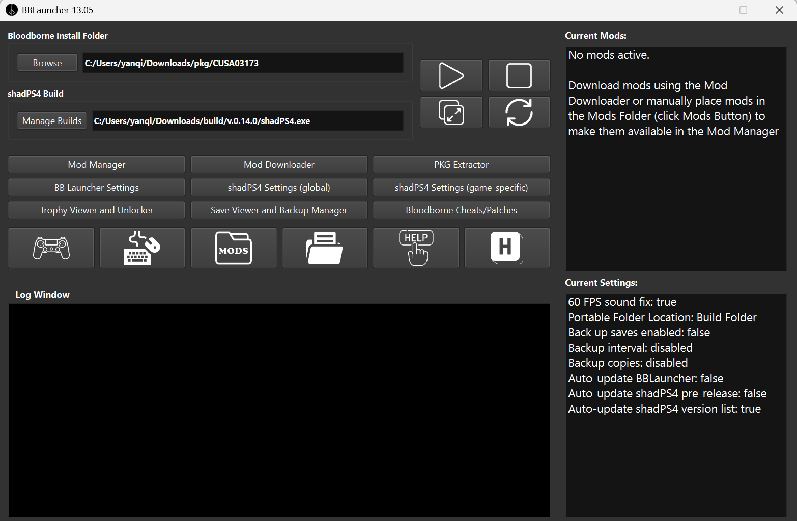

## 需要的文件

1. CUSA03173-Game-PRELUDE.pkg - 游戏本体
2. CUSA03173-EUR-Update-v1.09-PRELUDE.pkg - 游戏补丁
3. BBLauncher - 启动器
4. Chinese Retranslation GOTY zh-cn - 非常推荐的中文重译补丁

## 下载地址

这里给出[reddit](https://www.reddit.com/r/BloodbornePC/comments/1mc98xr/where_can_i_find_legit_files_for_bloodborne/)的讨论帖，在置顶评论可以找到上述的游戏文件

[BBLauncher](https://github.com/rainmakerv3/BB_Launcher)

[Chinese Retranslation GOTY zh-cn](https://www.nexusmods.com/bloodborne/mods/146)

## 安装步骤

1. 解压运行 BBLauncher
2. 点击 "PKG Extractor" 解压 pkg 文件
  - 找到游戏本体 pkg 文件
  - 选择解压后的文件路径
  - 点击 "Extract" 开始解压
3. 1.09补丁更新.pkg重复上述步骤
4. 使用 BBLauncher 下载 BUILDS
  - 点击 "Manage Builds" 按钮
  - 选择你先要下载到的路径
  - 选择你想要的版本并且下载

现在你的游戏本地、补丁、shadPS4都准备完毕了，对应如下图

## 使用一些重要的补丁

点击 "Bloodborne Cheats/Patchers" 按钮，选择 Patches 选项卡，点击 "Download Patches" 按钮，之后就会显示你的补丁列表，选择你需要的补丁进行安装

个人使用的补丁：
| Repo: shadPS4 | Repo: GoldHEN |
| -------- | -------- |
| Increased Graphics Heap Sizes | Skip Intro |
| Disable HTTP Requests | Disable Motion Blur |
| Uncap FPS(Deltatime)+(30fps Deltatime clamp) |  |
| Unlock Games Region |  |
| 1080p Light Grid |  |

这里推荐中文重译的补丁，需要你选择 Patches 中的 "Unlock Games Region" 选项，然后
1. 复制`Chinese Retranslation GOTY zh-cn`中的`menu`与`msg`文件夹到`CUSA03173\dvdroot_ps4`路径下，覆盖原文件
2. 复制`Chinese Retranslation GOTY zh-cn`中的`msg`文件夹到`CUSA03173-patch\dvdroot_ps4`路径下，覆盖原文件
3. 如果你不熟悉打开了 "Unlock Games Region" 补丁后的手柄映射可以点击 BBLauncher 面板中的手柄图标进行修改

恭喜你已经完成了所有的安装步骤，启动游戏开始愉快游玩吧！

## 参考资料

[FULL GUIDE - How to Play BloodBorne on PC for N00bs](https://www.reddit.com/r/shadps4/comments/1lee438/full_guide_how_to_play_bloodborne_on_pc_for_n00bs/
)
